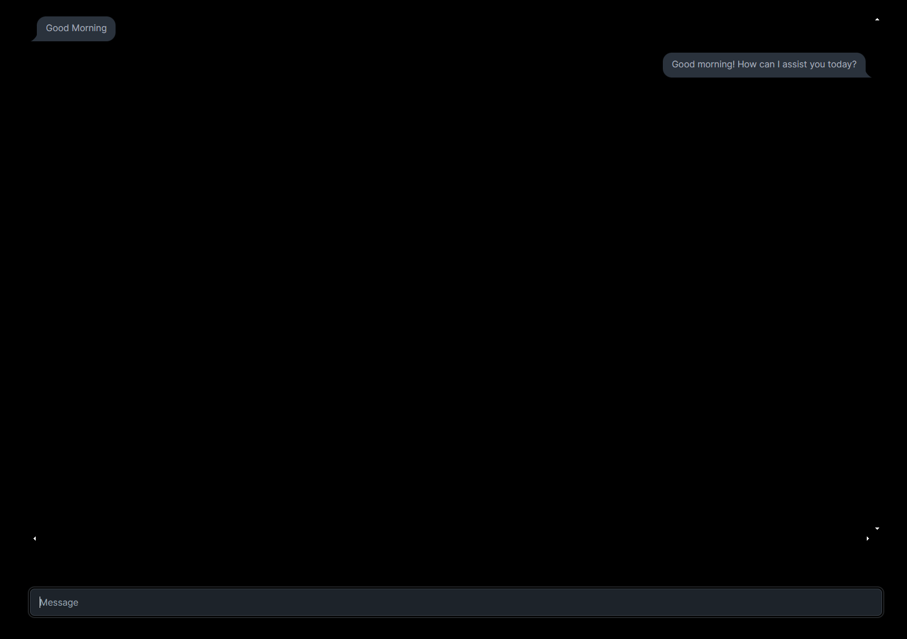

# <div align="center">Caht GPT Clone</div>


## About the Project

Chat GPT clone built with NextJS and NestJS with the integration with OpenAI API.

## Features

- 🤖 **ChatGPT Clone**: Interactive and responsive chat interface powered by OpenAI.
- 🎨 **Full Stack Application**: Built with Next.js for the frontend and NestJS for the backend.
- 🧩 **OpenAI Integration**: Seamless integration with OpenAI's powerful language models.
- 🚀 **Vercel Deployment**: Fast, secure, and reliable hosting with continuous deployment.

## Tech Stack

<div align="center">
  


</div>

## Project Structure
```bash
├───nestjs-openai
│   ├───src
│   │   └───openai
│   │       └───dto
│   └───test
└───nextjs-openai
    ├───public
    └───src
        └───app
```

## Installation
To run this project locally, follow these steps:

1. **Clone the repository**
   ```bash
   git clone https://github.com/mabedd/Gpt-Bot.git

2. **Navigate to the project directory**
   ```bash
   cd Gpt-Bot

### Frontend (Next.js)
3. **Navigate to the frontend directory**
    ```bash
    cd nextjs-openai
    ```

4. **Install Dependencies**
    ```bash
    npm install
    ```

5. **Start the App**
    ```bash
    npm run dev
    ```

### Backend (Nest.js)
6. **Navigate to the backend directory**
    ```bash
     cd nestjs-openai
    ```

7. **Install Dependencies**
    ```bash
    npm install
    ```

8. **Start the App**
    ```bash
    npm run start:dev
    ```


<div align="center">
  <p>Made with ❤️ by Mohammed</p>
</div>
